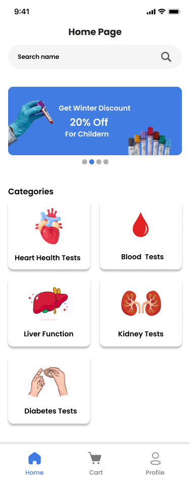

<a id="readme-top"></a>

<div align="center">

  <h3 align="center">Lab Link - Lab Test Booking Mobile App</h3>

  <p align="center">
    A mobile app designed to simplify lab test bookings for users and streamline order management for lab administrators.
    <br />
    <br />
  </p>
</div>

---

## 📱 About The Project

[](https://github.com/shareen-faisal/lab-link-lab-test-booking)

**Lab Link** is a cross-platform mobile application built to revolutionize how users book medical lab tests. Users can explore tests, book appointments, and receive updates, while labs can manage bookings and records through a dedicated admin panel.

<p align="right">(<a href="#readme-top">back to top</a>)</p>

---

## 🛠️ Built With

- 
- 
- 

<p align="right">(<a href="#readme-top">back to top</a>)</p>

---

## 🚀 Getting Started

Follow these instructions to set up and run the project on your local environment.

### 📋 Prerequisites

Make sure the following are installed:

- **Node.js** and **npm**
- **Python 3.x**
- **Apache Server** (XAMPP/WAMP) to host MySQL DB

---

### 📦 Installation Steps

1. **Clone the repository**
   ```bash
   git clone https://github.com/shareen-faisal/lab-link-lab-test-booking.git
