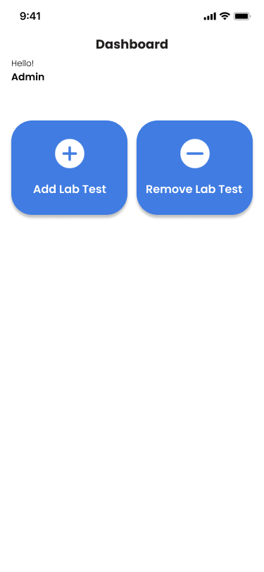
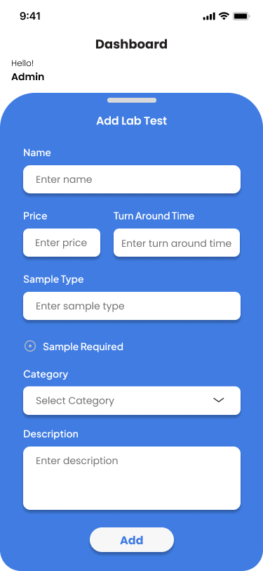
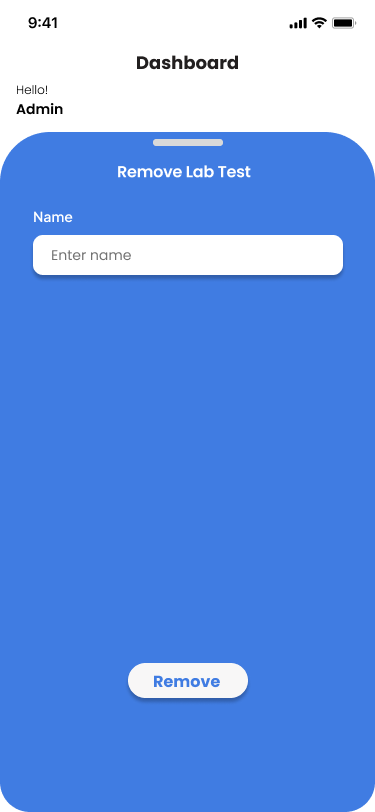
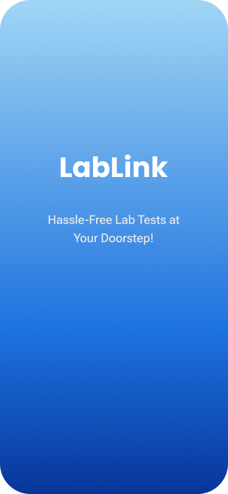

<a id="readme-top"></a>

<div align="center">

  <h3 align="center">Lab Link - Lab Test Booking Mobile App</h3>

  <p align="center">
    A mobile app designed to simplify lab test bookings for users and streamline booking management for lab administrators.
    <br />
    <br />
  </p>
</div>

---

## 📱 About The Project

**Lab Link** is a cross-platform mobile application built to revolutionize how users book medical lab tests. Users can explore tests, and book appointments for home sampling, while labs can manage bookings and records through a dedicated admin panel.

[](https://github.com/shareen-faisal/lablink-react-native-app)


<p align="right">(<a href="#readme-top">back to top</a>)</p>

---

## 🛠️ Built With

- 
- 
- 

<p align="right">(<a href="#readme-top">back to top</a>)</p>

---

## Getting Started

To get a local copy of the Lab Link project up and running on your machine, follow these steps.

### Prerequisites

- **Node.js and npm** must be installed. Download from [https://nodejs.org/](https://nodejs.org/)
- **Expo Go app** installed on your mobile device:
  - [Android (Play Store)](https://play.google.com/store/apps/details?id=host.exp.exponent)
  - [iOS (App Store)](https://apps.apple.com/app/expo-go/id982107779)

### Installation

#### 1. Clone the Repository

```bash
git clone https://github.com/shareen-faisal/lablink-react-native-app.git
cd lablink-react-native-app
```

### 📦 Install Dependencies

Install the required packages using npm:

```bash
npm install
```

### ▶️ Running the App

After the dependencies are installed, start the development server with Expo:

```bash
npx expo start
```

This will open a browser window with a QR code.  
Scan the QR code using the **Expo Go** app on your mobile device to launch and preview the app.

> Make sure your computer and phone are connected to the same Wi-Fi network.

<p align="right">(<a href="#readme-top">back to top</a>)</p>

---

## 📸 System Screenshots

<details>
<summary>🛠️ Admin Panel Screenshots</summary>

### Admin Dashboard


### Admin - Login


### Add Lab Test


### Remove Lab Test


</details>

<details>
<summary>👤 User Panel Screenshots</summary>

### Login Page


### Sign Up Page


### Title Page


### Search Page


### Lab Test Categories Page


### Lab Test Page


### Cart View


### Checkout Summary


### Checkout - Order Summary


</details>

## 📧 Contact

**Shareen Faisal**  
🔗 [GitHub](https://github.com/shareen-faisal)

<p align="right">(<a href="#readme-top">back to top</a>)</p>

---
